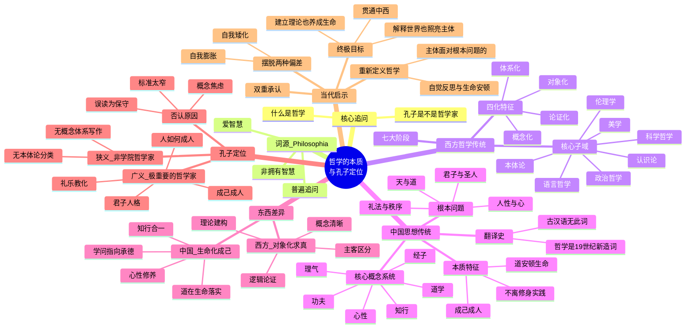

## 整体流程图

```mermaid
flowchart TD
    A[引论：关于哲学的四大流行误解] --> B{核心追问：<br>什么是哲学？<br>孔子是不是哲学家？}
    
    B --> C[哲学词源辨析]
    C --> C1["PHILOSOPHIA = 爱智慧<br>（不是拥有智慧，而是追求真理）"]
    
    B --> D[西方哲学七大发展阶段]
    D --> D1["① 早期希腊：从神话到理性<br>（自然本源追问）"]
    D1 --> D2["② 古典哲学：人与城邦<br>（苏格拉底转向伦理）"]
    D2 --> D3["③ 中世纪：信仰与理性<br>（神学哲学结合）"]
    D3 --> D4["④ 近代哲学：主体与知识<br>（笛卡尔"我思"）"]
    D4 --> D5["⑤ 德国古典哲学：历史与精神<br>（康德/黑格尔体系）"]
    D5 --> D6["⑥ 现代哲学：语言、存在、权力<br>（尼采/海德格尔/维特根斯坦）"]
    D6 --> D7["⑦ 当代哲学：AI、生态、文明危机"]
    
    D --> D_CORE["核心特征：<br>对象化 → 概念化 → 论证化 → 体系化"]
    
    B --> E["'哲学'一词的翻译史<br>（西周/日本/19世纪新造词）"]
    E --> E1["古汉语无'哲学'词 ≠ 中国无哲学思考<br>词没有不等于问题没有"]
    
    B --> F[中国古代的哲学关切]
    F --> F1["通过道学/经子/理气/心性/知行/功夫展开"]
    F --> F2["关心：天、道、人性、心、命、礼法、君子养成"]
    F --> F3["特点：抽象不离生命，知与行不可分"]
    
    F --> G[东西方哲学根本差异]
    G --> G1["西方：对象化求真<br>（概念清晰/逻辑论证/主客区分）"]
    G --> G2["中国：生命化成己<br>（道在生命落实/知行合一/心性修养）"]
    
    G --> H[孔子定位]
    H --> H1["狭义：不是学院概念体系建构者"]
    H --> H2["广义：全人类极重要的哲学家<br>（以'人如何成人'为核心）"]
    
    H --> I[三种否认孔子的原因]
    I --> I1["① 西方学院形式标准太窄"]
    I --> I2["② 误读为伦理保守者"]
    I --> I3["③ 近代学科切割导致的'概念焦虑'"]
    
    I --> J{"中国思想的根词：<br>不是哲学，而是'道'"}
    J --> J1["道 = 天地运行之理 +<br>人伦秩序之理 +<br>生命成就之路"]
    
    J --> K[两种偏差须摆脱]
    K --> K1["自我矮化<br>（只有西方有哲学）"]
    K --> K2["自我膨胀<br>（中国什么都有）"]
    K --> K3["成熟态度：<br>双重承认"]
    
    K --> L["明晰研究院哲学定义<br>主体面对世界/生命/知识/价值/秩序/行动的<br>根本反思与生命安顿的智慧活动"]
    
    L --> M[最终指向：贯通中西]
    M --> M1["西方→概念逻辑和体系"]
    M --> M2["中国→道学和功夫"]
    M --> M3["目标：让哲学不止解释世界，<br>也照亮主体；不止建立理论，<br>也养成生命"]
```

---

## 各章节详细知识点

### 一、引论：流行的误解与核心追问（00:00-00:39）

#### 主题内容
视频开篇直接抛出核心问题——"什么是哲学？孔子是不是哲学家？"，随后列举了大众对哲学的四种常见误解，以此作为整个论述的启动点。

#### 核心概念

| 误解类型 | 具体内容 |
|---------|---------|
| 大师谱系论 | 哲学 = 苏格拉底、柏拉图、亚里士多德、康德、黑格尔的西方大师名单 |
| 抽象概念论 | 哲学 = 抽象概念、逻辑推演、形而上学、学院论文 |
| 现实无用论 | 哲学离现实很远，不能吃饭、不能赚钱、不能解决具体问题 |
| 中国缺席论 | 中国古代没有哲学，孔子不是哲学家，儒家老庄不是哲学，中国只有伦理、政治、宗教、人生智慧、经学或修身传统 |

#### 核心特性/工作原理
视频采用"先破后立"的论证策略——先把四种误解全部摆上桌面，尤其是第四种"中国缺席论"作为全片的核心争议靶点，再逐一剖析其背后的标准问题。

#### 对比/示例/注意事项
这四种误解具有层次递进关系：前三种是对哲学"是什么"的错位理解，第四种则涉及中国思想在学科分类中的身份焦虑。视频特别强调第四种误解是"一种常常说"的声音，暗示这一判断在中文公共讨论中具有相当的普遍性和迷惑性。

---

### 二、哲学的词源辨析（00:39-01:12 / 04:51-07:44）

#### 主题内容
追溯philosophy的希腊词源PHILOSOPHIA（经拉丁语传入英国），揭示其本意为"爱智慧"（love of wisdom），并强调这一起点对于理解哲学本质的关键意义。

#### 核心概念

- **PHILOSOPHIA** = philo（爱）+ sophia（智慧），意为"爱智慧"
- **哲学的本质不是答案，而是追问**：不是已经抵达真理，而是追求真理；不是自称掌握答案，而是在根本问题面前保持追问

#### 核心特性/工作原理
视频通过词源学辨析确立了一个关键前提——哲学从其诞生之初就具有开放性和包容性。"爱智慧"这一原意本身就意味着哲学不应该是某一特定文明或传统的专利，因为"爱智慧"是人类普遍的倾向。这为后续论证中国古代有哲学性思考奠定了理论基础。

#### 对比/示例/注意事项

| 错误理解 | 正确理解 |
|---------|---------|
| 哲学 = 拥有智慧 | 哲学 = 爱智慧（追求智慧） |
| 哲学 = 抵达真理 | 哲学 = 追求真理 |
| 哲学 = 掌握答案 | 哲学 = 在根本问题面前保持追问 |

---

### 三、西方哲学的发展脉络七大阶段（01:12-07:44）

#### 主题内容
全景式梳理西方哲学从古希腊到当代的七大发展阶段，展示其"不断把根本问题对象化、概念化、论证化、体系化"的内在动力。

#### 核心概念

**七大阶段速览**

| 阶段 | 时间 | 核心关切 | 代表人物/学派 |
|------|------|---------|-------------|
| 第一阶段：从神话到理性的自然追问 | 公元前6-5世纪 | 世界本源（水、气、火、数、原子、无限者） | 泰勒斯、赫拉克利特、德谟克利特 |
| 第二阶段：古典哲学的人与城邦 | 公元前5-4世纪 | 人应当如何生活、善、正义、勇敢、节制 | 苏格拉底、柏拉图、亚里士多德 |
| 第三阶段：中世纪哲学的信仰与理性 | 5-15世纪 | 上帝、灵魂、信仰、存在、善恶普遍概念 | 奥古斯丁、阿奎那 |
| 第四阶段：近代哲学的主体与知识 | 16-18世纪 | "我思故我在"、知识来源、主体如何可能经验世界 | 笛卡尔、洛克、休谟、康德 |
| 第五阶段：德国古典哲学 | 18-19世纪 | 主体自由、理性、历史精神、国家秩序 | 康德、费希特、谢林、黑格尔 |
| 第六阶段：现代哲学的反思与解构 | 19-20世纪 | 价值批判、存在追问、语言分析、意识经验、权力话语 | 尼采、海德格尔、维特根斯坦、现象学、存在主义、法兰克福学派、后结构主义 |
| 第七阶段：当代哲学 | 21世纪 | AI、生命科学、认知科学、生态伦理、技术治理、文明危机 | — |

#### 核心特性/工作原理

西方哲学的核心特征可概括为四化过程：**对象化 → 概念化 → 论证化 → 体系化**。具体表现为：

1. 非常重视**定义、概念、范畴**的精确性
2. 强调**逻辑论证、反驳与系统建构**的严密性
3. 具有强大的**抽象能力和理论推进能力**
4. 深刻影响了现代**科学、法学、政治学、社会科学与大学学科制度**

#### 对比/示例/注意事项
视频特别指出第一阶段的意义"不在于他们的具体答案今天是否成立，而在于他们开始摆脱神话解释，尝试用理性观察和推论理解世界"——这是一种方法论上的跨越而非结论上的正确。第七阶段当代哲学的论述值得注意：视频认为哲学"已经不只是书斋里的抽象思辨，越来越进入人工智能、生命科学、认知科学、生态伦理、技术治理、平台权力、身份政治、文明冲突与人类未来问题"，暗示哲学正在经历一次新的功能转向。

---

### 四、"哲学"一词的翻译史与概念解构（02:55-04:51）

#### 主题内容
揭示一个常被忽略的历史事实："哲学"这个汉语词是近代翻译产物，古汉语中并没有现代意义上的"哲学"一词。这是全片论证链条中最具"去魅"效果的关键环节。

#### 核心概念

- **哲学**（汉语词）= 日本启蒙思想家西周在19世纪60年代左右新造的翻译概念
- 此前philosophy曾被音译为"斐路索菲亚"等
- "哲学"一词的形成与**程朱理学、心理学和西方philosophy的碰撞**有关
- 它是一个"东西方思想相遇后，在汉字系统中重新造出来的现代概念"

#### 核心特性/工作原理
这一历史追溯揭示了"中国古代没有哲学"这一判断的微妙性：

- 如果指"中国古代没有'哲学'这个现代学科名称"——这是对的
- 如果指"中国古代没有哲学性思考"——这就太粗糙了

视频使用了精妙的类比论证：
- 中国古代没有"社会学"这个学科名称 → 但中国人长期思考社会秩序、家国结构、人群治理与礼法制度
- 中国古代没有"心理学"这个学科名称 → 但中国人长期思考心、性、情、欲、意志、知行与修身功夫

#### 对比/示例/注意事项

| 论证层次 | 逻辑公式 |
|---------|---------|
| 词没有 ≠ 问题没有 | 缺乏命名不等于缺乏对象 |
| 学科没有 ≠ 思想没有 | 缺乏制度分类不等于缺乏思考活动 |
| 近代名称没有 ≠ 古代智慧不存在 | 缺乏现代标签不等于缺乏历史深度 |

---

### 五、中国古代的哲学关怀（07:44-09:53）

#### 主题内容
在"哲学"一词的翻译史之后，视频正面阐述中国古代思想的哲学性——它不是以"哲学"这个近代学科名称来组织思想，而是通过一套自有概念系统来展开。

#### 核心概念

**中国古代思想的组织概念系统**

| 概念系统 | 主要范畴 |
|---------|---------|
| 道学 | 道、德、天道、人道 |
| 经子 | 经学、子学、经史传统 |
| 理气 | 天理、气、理气关系 |
| 心性 | 心、性、情、欲 |
| 性命 | 天命、性命、立命 |
| 理法 | 礼法、理法关系 |
| 名实 | 名实、正名 |
| 知行 | 知、行、知行合一 |
| 功夫 | 修身、克己、致良知、变化气质 |

**中国古代关心的根本问题**

天是什么？道是什么？人是什么？性是什么？命是什么？心如何安顿？欲望如何节制？人如何承德？家国如何承序？名实如何相符？礼法如何运行？君子如何养成？圣人何以可能？知识与行动是什么关系？天道、人道、正道如何贯通？

#### 核心特性/工作原理
中国思想的核心特点在于其**实践性和生命性**：

1. 很少把问题从**生命实践、伦理秩序、政治治理、修身功夫**中完全抽离出来
2. 不把一个形而上学问题变成纯粹对象化的理论领域
3. 更关心的是"你知道了道能不能行道""你明白了礼能不能变化气质""你谈仁义能不能落实在人伦之中"
4. "抽象常常不愿离开生命"

#### 对比/示例/注意事项
视频在此处引入了一个重要的方法论警告："用欧洲哲学的分类硬套中国思想，很容易发生扭曲"。这一观点触及了比较哲学的核心难题——使用一套源于特定文明的概念框架来评判另一套完全不同的思想传统，本质上就是在预设结论。

---

### 六、东西方哲学的根本差异（09:53-11:59）

#### 主题内容
构建东西方哲学的比较框架，提炼二者在"大体气质"上的差异，同时避免简单的二元对立。

#### 核心概念

**东西方哲学根本差异对照**

| 维度 | 西方哲学 | 中国哲学 |
|------|---------|---------|
| 核心取向 | 对象化求真 | 生命化成己 |
| 方法论 | 概念清晰、逻辑论证 | 道在生命中落实 |
| 主客关系 | 主客区分 | 个体嵌入关系 |
| 知识取向 | 知识体系、理论建构 | 知与行不可分 |
| 真理观 | 真理可辨 | 智慧化成生命状态 |
| 关怀焦点 | 辨明对象 | 成就主体 |
| 典型提问 | 这个概念是否成立？这个论证是否有效？ | 这个道理能否安顿生命？能否成己成仁？ |
| 核心能力 | 把问题拆出来讲清楚、论证清楚 | 把问题放回生命关系、秩序和功夫之中 |

#### 核心特性/工作原理
视频特别强调的是——**不能简单说"西方哲学只是抽象，中国哲学只是实践"**。视频明确指出了反例：

- **西方**也有生活哲学、伦理修养，如斯多葛传统、宗教灵修、存在主义
- **中国**也有精细的概念辨析，如名家、墨家、玄学、理学

差异是"大体气质"上的倾向性差异，而非绝对的类别划分。

#### 对比/示例/注意事项
视频从"明晰研究院主体生命系统视角"给出了一个精炼总结："西方哲学的长处是把问题拆出来讲清楚，中国哲学的长处是把问题放回生命关系、秩序和功夫之中。"这一判断不预设立场上的优劣，而是承认各自的不可替代性。

---

### 七、孔子是不是哲学家——核心论证（11:59-14:19）

#### 主题内容
回到全片的核心问题，给出一个区分性回答——取决于使用哪种"哲学家"的定义标准。

#### 核心概念

**两种标准下的孔子定位**

| 标准 | 定义 | 孔子是否符合 | 结论 |
|------|------|------------|------|
| 狭义学院标准 | 近代大学学科里的概念体系建构者 | 否（未写《纯粹理性批判》，未按本体论/认识论/伦理学分类建构学院体系） | 不是这种意义上的哲学家 |
| 广义人类标准 | 在人类根本问题上形成原创性理解，深刻改变一个文明对人、秩序、德性、教育、政治关系和生命成就的理解 | 是（以"人如何成人"为核心，开创了中国式主体养成道路） | 当然是哲学家，而且是全人类极重要的哲学家 |

#### 核心特性/工作原理
孔子的哲学特征可概括为：

- **起点**：不是"世界由什么构成"，而是"人如何成人"
- **核心问题**：不是抽象宇宙论，而是"人如何成为君子"
- **目标**：成己成人
- **路径**：礼乐教化
- **核心**：人（而非抽象理念）
- **人格模型**：君子
- **展开场域**：家国天下
- **哲学类型**：主体生命系统的哲学（而非狭义学院哲学）

#### 对比/示例/注意事项
视频指出孔子的身份具有多重复杂性——他是教师、礼乐传统的传承者、政治秩序的思考者、道德教育家、文明修复者、中国式主体养成道路的奠基者之一。"哲学家"这个现代词不能完整覆盖孔子，但孔子的思想当然包含深刻的哲学性。孔子的哲学"以成己成人为目标，以礼乐教化为路径，以人为核心，以君子为人格模型，以家国天下为展开场域"。

---

### 八、为什么有人说孔子不是哲学家——三种原因分析（14:19-16:12）

#### 主题内容
逐一分析否认孔子是哲学家的三种原因，从标准误用、误读到学科焦虑，层层递进。

#### 核心概念

**三种否认原因分析**

| 原因 | 具体内容 | 问题所在 |
|------|---------|---------|
| ① 西方学院哲学的形式标准 | 孔子没有用概念体系写作，没有形成类似柏拉图、亚里士多德、康德的理论文本 | 标准太窄——如果哲学只能等同于西方学院传统，中国古代大部分思想都会被排除，暴露的是这个哲学定义本身太狭窄 |
| ② 误读为伦理保守者 | 只看到孝、礼、君臣父子等级秩序，认为孔子只是传统伦理和政治秩序的维护者 | 忽略了孔子在礼崩乐坏的时代重新提出"人如何通过学礼、仪、仁、义、信、忠、恭敬而成为更高质量的人" |
| ③ 近代"概念焦虑" | 中国知识体系被迫进入西方学科分类后，贯通性的"道学经史"被切割成哲学/科学/宗教/伦理/政治/文学/历史 | 中国古代思想本来就不是按照西方学科切割的方式长出来的，这种分类本身就带有现代学科切割的前提 |

#### 核心特性/工作原理
第三种原因最为深刻：它揭示的是整个近代中国知识界在面对西方学科制度时产生的结构性焦虑。中国思想经常被追问"你到底是哲学还是宗教？是伦理学还是政治学？是文学还是人生智慧？"——这种问题本身就预设了西方学科分类框架的合法性，而中国古代思想"本来就不是按这个方式长出来的"。

#### 对比/示例/注意事项
视频在此处引入了一个极具洞察力的判断：**"中国古代真正关心的是道，而不仅是哲学。"** 这为下一章节的"道"概念讨论做了铺垫。

---

### 九、中国思想的根词——"道"（16:12-17:50）

#### 主题内容
提出一个核心主张：如果用中国自身的核心词来对应philosophy，最接近的可能不是"哲学"而是"道"。

#### 核心概念

**"道"的四重涵义**

| 维度 | 内涵 |
|------|------|
| 天地运行之理 | 宇宙论层面——自然运行的根本法则 |
| 人伦秩序之理 | 社会论层面——人际关系的正当秩序 |
| 生命成就之路 | 存在论层面——个体生命的成长路径 |
| 行动应当遵循的方向 | 实践论层面——行为选择的正确导向 |

**各家之"道"的侧重**

| 学派 | 关注之"道" | 核心范畴 |
|------|-----------|---------|
| 儒家 | 重在人道 | 人道、礼道、君子之道、为政之道 |
| 道家 | 重在天地自然 | 无为、齐物、逍遥、万物自化 |
| 墨家 | 重在兼爱非攻 | 兼爱、尚贤、节用、社会功力 |
| 法家 | 重在依法治国 | 法、术、势、国家治理 |
| 名家 | 重在语言逻辑 | 名实、语言与逻辑 |
| 佛学 | 重心性觉悟 | 空、有、觉悟、烦恼与解脱 |
| 宋明理学 | 系统化天理心性 | 天理、心性、格物、诚意、致良知 |

#### 核心特性/工作原理
"道"相较于近代"哲学"学科的几个特质：

1. **更宽**：涵盖宇宙论、人生论、政治论、实践论
2. **更深**：触及天人关系、知行关系、心性修养等根本问题
3. **更生活化**：不离日常实践、修身功夫、伦理关系

中国思想的根本关怀不是"哲学化的解释世界"，而是"以道安顿生命，以学成就主体，以礼法组织共同生活"。

#### 对比/示例/注意事项
"道"的核心竞争力在于其贯通性——它是自然法则、人伦秩序、生命道路和行动方向的一体化概念。这一特点恰好回应了前文所提"中国古代思想不是按学科切割方式长出来的"这一判断。

---

### 十、当代启示与哲学再定义（17:50-21:30）

#### 主题内容
视频的收束部分——提出中国人今天应如何看哲学，给出明晰研究院自创的哲学定义，并号召贯通中西。

#### 核心概念

**两种须摆脱的偏差**

| 偏差 | 表现 | 问题 |
|------|------|------|
| 自我矮化 | 一听哲学就觉得只有西方才有，中国古代只是经验、伦理修养和政治说教 | 忽略了中国思想在心性修身、礼法秩序、天人关系、知行关系、主体养成方面的巨大深度 |
| 自我膨胀 | 中国什么都有，什么都比西方强，不需要学习西方哲学 | 西方哲学在逻辑、概念、论证、科学精神、主体理论、语言分析、知识批判方面有极其强大的成果 |

**成熟态度：双重承认**

| 承认西方 | 承认中国 |
|---------|---------|
| 概念力量 | 思想的生命深度 |
| 现代学科的清晰性 | 中华文脉的贯通性 |
| 理论辨析的重要 | 道学和功夫的深厚 |

**明晰研究院的哲学定义**

> 哲学是**主体**面对**世界、生命、知识、价值、秩序与行动**的根本问题时，进行**自觉反思、概念辨析、意义建构与生命安顿**的智慧活动。

定义中的七个关键词：

| 维度 | 内涵 |
|------|------|
| 主体 | 哲学不是没有人的抽象概念游戏，而是主体在追问 |
| 世界 | 哲学关心存在、自然、宇宙与整体秩序 |
| 生命 | 哲学关心人如何活、如何死、如何面对痛苦欲望与有限性 |
| 知识 | 哲学关心人如何知道、凭什么相信、如何判断真假 |
| 价值 | 哲学关心善恶、正义、美、尊严、意义与值得追求之物 |
| 秩序 | 哲学关心个人、家庭、组织、国家、文明如何形成正当结构 |
| 行动 | 哲学不能只停在想法里，还要回到如何生活、如何选择、如何修正自己 |

#### 核心特性/工作原理
这个定义的设计巧妙之处在于它兼容了西方哲学的长处和中国的思想传统：

- **概念辨析、逻辑论证** ← 呼应西方哲学的强项
- **意义建构、生命安顿** ← 呼应中国思想的强项
- **主体** ← 既是近代西方主体性哲学的核心概念，也与中国"心性"传统相通

视频最终的升华极其关键：**"中国人今天重新理解哲学，最重要的不是争一个名分，而是拿回解释权。"** 这意味着"中国有没有哲学"这个问题本身可能是一个伪问题——真正的问题是如何让哲学在当下重新发挥其应有的功能。

#### 对比/示例/注意事项
视频最终落脚点在当代——在人工智能、组织复杂度、个体压力、文明转型同时加速的时代，哲学不能只是大学里的专业或书斋里的抽象谈资。它提出了几个当代必须回应的问题：人如何成为主体？企业如何形成正道？技术如何不吞噬人？文明如何保持清明？这正是"把哲学接回中国人的生命问题、主体问题、组织问题、文明问题"的具体指向。

---

## 总结

### 概念关系图



### 核心要点速记

| 概念 | 一句话总结 |
|------|---------|
| **Philosophia（希腊词源）** | "爱智慧"而非"拥有智慧"——哲学本质是追问而非答案 |
| **哲学（汉语词源）** | 19世纪日本学者西周新造的翻译概念，古汉语中无此词 |
| **西方哲学核心特征** | 对象化→概念化→论证化→体系化，具有强大的抽象能力和理论推进能力 |
| **中国思想组织方式** | 通过道学、经子、理气、心性、知行、功夫等自有概念系统展开，而非"哲学"学科 |
| **东西方根本差异** | 西方偏"对象化求真"，中国偏"生命化成己" |
| **两种偏差** | 自我矮化（只有西方有哲学）和自我膨胀（中国什么都有），成熟态度是双重承认 |
| **孔子（狭义）** | 不是近代学院意义上的概念体系建构者 |
| **孔子（广义）** | 全人类极重要的哲学家——以"人如何成人"为核心，代表主体生命系统的哲学 |
| **道** | 比"哲学"更能概括中国思想的核心概念——天地运行之理、人伦秩序之理、生命成就之路 |
| **明晰研究院哲学定义** | 主体面对世界/生命/知识/价值/秩序/行动的根本问题时进行自觉反思、概念辨析、意义建构与生命安顿的智慧活动 |
| **最终指向** | 贯通中西：西方给了概念逻辑和体系，中国给了道学和功夫，目标是让哲学既解释世界也照亮主体、既建立理论也养成生命 |

*内容由 AI 生成仅供参考*